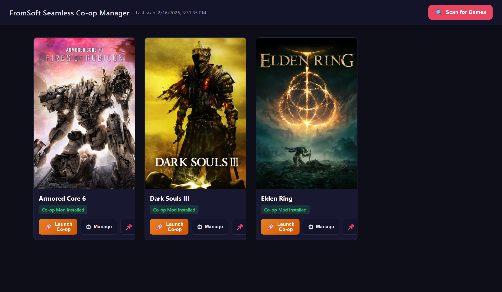
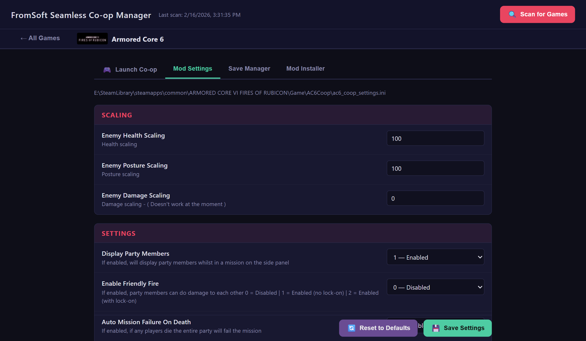
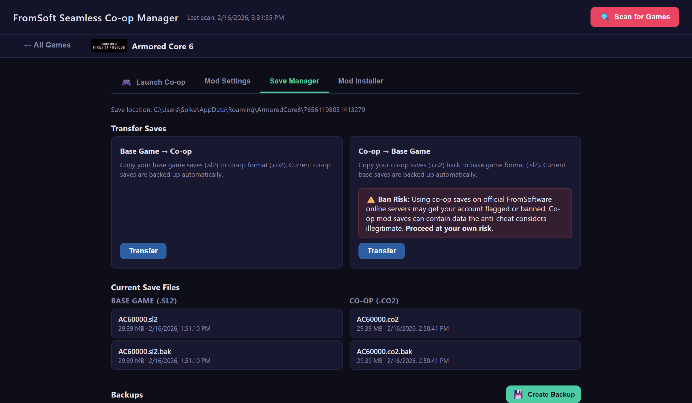
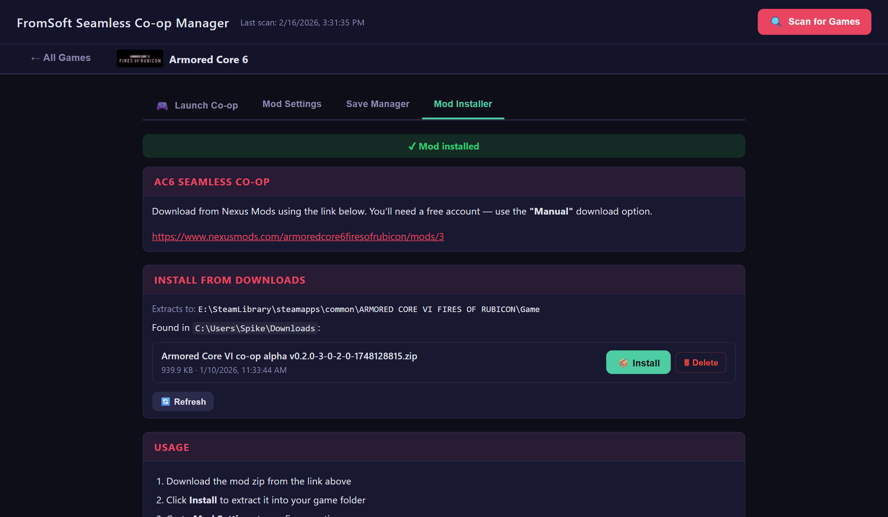

# FromSoft Seamless Co-op Manager

An all-in-one desktop tool for managing Seamless Co-op mods across multiple FromSoftware games. Install mods, configure settings, manage save files, launch co-op sessions, and create desktop shortcuts — all from a clean web-based dashboard running locally on your PC.

> **Note:** This is a **manager tool only**. The Seamless Co-op mods themselves are created by [LukeYui](https://github.com/LukeYui). All credit for the actual mods goes to them — this project simply provides a convenient way to install, configure, and launch them.


> **Quick install:** Download `Setup_FromSoft_Coop_Manager.bat` from the latest [Release](https://github.com/spikehockey75/FromSoftSeamlessCoOpManager/releases), double-click it, and you're done.

## Screenshots

<div align="center">

| Dashboard | Settings |
|-----------|----------|
| [](images/dashboard.png) | [](images/settings-tab.png) |

| Save Manager | Mod Installer |
|--------------|---------------|
| [](images/save-manager.png) | [](images/mod-installer.png) |

</div>

---

## Supported Games

| Game | Co-op Mod | Nexus Mods |
|------|-----------|------------|
| **Armored Core 6: Fires of Rubicon** | AC6 Seamless Co-op | [Link](https://www.nexusmods.com/armoredcore6firesofrubicon/mods/3) |
| **Dark Souls Remastered** | DSR Seamless Co-op | [Link](https://www.nexusmods.com/darksoulsremastered/mods/899) |
| **Dark Souls III** | DS3 Seamless Co-op | [Link](https://www.nexusmods.com/darksouls3/mods/1895) |
| **Elden Ring** | Elden Ring Seamless Co-op | [Link](https://www.nexusmods.com/eldenring/mods/510) |
| **Elden Ring Nightreign** | ER Nightreign Seamless Co-op | [Link](https://www.nexusmods.com/eldenringnightreign/mods/3) |

> The tool automatically scans all your Steam library folders across all drives and detects which games you have installed. It uses Steam's `appmanifest` files to verify a game is truly installed (not just leftover files from an uninstall).

---

## Features

### 🏠 Game Dashboard (Landing Page)

- Shows all detected games as cards with **Steam cover art**
- Each card displays the mod installation status (installed / not installed)
- Three actions per game:
  - **Launch Co-op** — starts the co-op mod launcher directly
  - **Manage** — opens the game's detail view with all sub-tabs
  - **Desktop Shortcut** — creates a Windows desktop shortcut for the game's co-op launcher, using the game's Steam cover art as the icon and named clearly (e.g., "Dark Souls III Co-op")

### 🚀 Launch Tab

- Displays the game's full Steam library cover art
- Double-click the cover art to launch the co-op mod
- Visual feedback during launch (launching → launched states)
- Warning shown if the launcher executable is missing

### ⚙️ Settings Tab

- Reads and displays all settings from the mod's `.ini` config file
- Automatically determines input types from the mod's own comments:
  - **Dropdowns** for settings with limited choices (0/1, on/off)
  - **Number fields** with min/max ranges
  - **Text inputs** for passwords and open values
- Shows the setting description (pulled from INI comments)
- **Dirty tracking** — changed fields are highlighted with a change indicator
- **Save confirmation** — shows a table of all changes before saving
- **Undo button** — reverts all unsaved changes
- **Reset to Defaults** — restores every setting to the mod author's default values
- **Unsaved changes protection** — prompts before switching tabs or closing the browser
- Changes are saved directly to the mod's config file on disk

### 💾 Save Manager Tab

- Lists all save files in the game's `%APPDATA%` save directory
- Shows base game saves (`.sl2`) and co-op saves (`.co2`) side by side
- **Transfer** — copies a base save to a co-op save (or vice versa), with a timestamp to prove freshness
- **Backup** — creates timestamped backups of individual save files
- **Restore** — restores any backup with a confirmation dialog
- **Delete** — removes backups with confirmation

> ⚠️ **Ban Risk Warning:** Transferring co-op saves back to the base game (Co-op → Base Game) and then playing on official FromSoftware online servers may result in your account being flagged or banned. Co-op mod saves can contain data that the anti-cheat system considers illegitimate. **Use this feature at your own risk.** The authors of this tool are not responsible for any bans or penalties incurred.

### 📦 Mod Installer Tab

- Direct link to the mod's Nexus Mods page for downloading
- Automatically scans your **Downloads folder** for matching mod zip files
- One-click **Install** — extracts the zip into the correct game directory
- **Delete** button next to each zip — removes the download with confirmation to keep your Downloads folder clean
- Post-install cleanup prompt — after a successful install, asks if you'd like to delete the zip file
- After installation, hidden tabs (Launch, Settings, Saves) are revealed automatically
- **Refresh** button to re-scan Downloads

---

## Installation

### Prerequisites

- **Windows 10/11**
- **Steam** with at least one supported game installed

> That's it. The installer handles everything else — Python, dependencies, shortcuts — all automatically.

### Quick Install (Recommended)

1. Download **`Setup_FromSoft_Coop_Manager.bat`** from the latest [GitHub Release](https://github.com/spikehockey75/FromSoftSeamlessCoOpManager/releases)
2. **Double-click it**
3. Done.

The single installer file does everything:

| Step | What it does |
|------|-------------|
| **1/6** | Installs Python automatically if missing (via `winget` or direct download) |
| **2/6** | Downloads the full application from GitHub |
| **3/6** | Installs to `%LOCALAPPDATA%\FromSoftCoopManager` |
| **4/6** | Creates an isolated virtual environment |
| **5/6** | Installs dependencies (Flask, Pillow) |
| **6/6** | Creates launcher scripts and a **desktop shortcut** |

### Alternative: Clone the Repo

If you prefer to clone the repo (e.g., for development):
```
git clone https://github.com/spikehockey75/FromSoftSeamlessCoOpManager.git
cd FromSoftSeamlessCoOpManager
Setup_FromSoft_Coop_Manager.bat
```
The installer detects it's already inside the repo and skips the download step.

### Launch the App

After installation, start the app any of these ways:

| Method | How |
|--------|-----|
| **Desktop shortcut** | Double-click "FromSoft Seamless Co-op Manager" on your Desktop |
| **run.bat** | Double-click `run.bat` in the install folder |
| **From installer** | The installer asks "Launch the app now?" at the end |

Your default web browser opens automatically to `http://127.0.0.1:5000`.

> **No console window!** The desktop shortcut and installer both use a silent launcher — the server runs entirely in the background with no terminal window. Just close the browser tab when you're done.

---

## How to Use

### First Launch

1. The app opens in your browser showing a welcome screen
2. Click **🔍 Scan for Games** in the top-right corner
3. The tool scans all drives for Steam libraries and co-op mods
4. Game cards appear on the dashboard for each detected game

### Managing a Game

Click **Manage** on any game card to access its sub-tabs:

- **Launch** — launch the co-op mod directly
- **Settings** — view and edit all mod configuration
- **Saves** — manage save files and backups
- **Mod Installer** — install or update the mod from a downloaded zip

Click **← All Games** to return to the dashboard (data is always refreshed).

### Installing a Mod

1. Click **Manage** on the game card
2. Go to the **Mod Installer** tab
3. Click the **Nexus Mods link** to download the mod zip
4. The tool automatically detects the zip in your Downloads folder
5. Click **Install** — confirms and extracts into the game directory
6. After install, you're prompted to **clean up** (delete) the zip from Downloads
7. The Launch, Settings, and Saves tabs become available

### Creating Desktop Shortcuts

- **App shortcut** — created automatically by `Setup_FromSoft_Coop_Manager.bat` → "FromSoft Seamless Co-op Manager"
- **Game shortcuts** — click **Desktop Shortcut** on any game card → creates e.g., "Armored Core 6 Co-op" with the game's Steam cover art as the icon, pointing directly to the co-op launcher

### Rescanning

If you install or uninstall a game, click **Scan for Games** again. The tool verifies Steam app manifests, so uninstalled games are automatically removed even if leftover mod files remain.

---

## Folder Structure

```
FromSoftSeamlessCoOpManager/
├── Setup_FromSoft_Coop_Manager.bat  ← One-time setup (double-click first)
├── Uninstall_FromSoft_Coop_Manager.bat  ← Uninstaller (removes app + shortcuts)
├── launch.vbs           ← Silent launcher (no console window)
├── run.bat              ← Starts the app (called by launch.vbs)
├── server.py            ← Flask backend (scanner, APIs, launcher)
├── requirements.txt     ← Dependencies (flask, Pillow)
├── config.json          ← Auto-generated after first scan
├── FSSIcon.png          ← App icon source (PNG)
├── FSSIcon.ico          ← App icon (auto-converted by installer)
├── README.md            ← This file
├── .venv/               ← Python virtual environment (auto-created)
├── icons/               ← Cached game icons for desktop shortcuts
├── templates/
│   └── index.html       ← HTML template
└── static/
    ├── style.css        ← Dark-themed UI styling
    └── app.js           ← Frontend logic (dashboard, tabs, forms)
```

---

## FAQ

### Can I get banned for using this?

**No.** The co-op mod prevents you from connecting to FromSoftware's matchmaking servers and uses save files different to the non-modded game. There is no way to get banned using this mod unless you modify it with the intent of connecting to vanilla players.

Because the mod introduces new items not found in the base game, it uses a different save file to the normal `.sl2` extension. This means you cannot access your Seamless Co-op save files in the base game, and vice versa. **Do not revert mod save files back to vanilla save files, as you will likely get banned.**

> ⚠️ The **Co-op → Base Game** transfer in the Save Manager exists for convenience, but using it and then going online on official FromSoftware servers risks a ban. See the [Save Manager](#-save-manager-tab) section for the full warning.

### "Python is not recognized" error

The automatic Python installation may have failed, or PATH wasn't updated.

**Fix:** Open a **new** Command Prompt and run `Setup_FromSoft_Coop_Manager.bat` again. If it still fails, install Python manually from [python.org/downloads](https://www.python.org/downloads/) and **check "Add python.exe to PATH"** during install.

### The app didn't find my game

Make sure:
- The game is installed via **Steam** (the tool checks for Steam app manifests)
- If you want Settings/Saves/Launch, the **co-op mod** must be installed in the game folder
- Expected mod config locations:
  - AC6: `<game>\Game\AC6Coop\ac6_coop_settings.ini`
  - DS3: `<game>\Game\SeamlessCoop\ds3sc_settings.ini`
  - Elden Ring: `<game>\Game\SeamlessCoop\ersc_settings.ini`

### I uninstalled a game but it still shows up

Click **Scan for Games** or just refresh the page. The app checks Steam's `appmanifest_<appid>.acf` file — if it's gone, the game is automatically removed from the dashboard.

### How do I stop the app?

The server runs in the background — there's no console window to close. To stop it:
- **Easiest:** Just close your browser tab. The server uses minimal resources and will be cleaned up when you shut down or log off.
- **Manual:** Open Task Manager (`Ctrl+Shift+Esc`), find `pythonw.exe` or `python.exe`, and end the task.

### Can I move the folder?

Yes. The app is installed to `%LOCALAPPDATA%\FromSoftCoopManager` by default. You can move this folder wherever you want, then run `Setup_FromSoft_Coop_Manager.bat` again to update the desktop shortcut.

### Does this modify my game files?

**No.** It only reads and writes the co-op mod's `.ini` settings file — the same file you could edit in Notepad. It never touches game executables or Steam files. Save file operations only affect save files in `%APPDATA%`.

### My antivirus flagged it

This sometimes happens with Python scripts and PowerShell shortcut creation. The app is fully open source — every line of code is readable. To fix:
- Allow the app through your antivirus settings
- Or right-click `run.bat` → Properties → check **Unblock** → OK

### Can I add support for another game?

Yes. Add a new entry to the `GAME_DEFINITIONS` dictionary in `server.py`. Each entry defines the Steam folder name, config file path, launcher path, save directory, Nexus Mods URL, and default settings. See the existing AC6/DS3/ER entries for the format.

---

## Uninstalling

### Easy Uninstall (Recommended)

Double-click **`Uninstall_FromSoft_Coop_Manager.bat`** in the app folder. It will:
- Stop any running instances
- Delete the app folder (`%LOCALAPPDATA%\FromSoftCoopManager`)
- Remove all shortcuts (Desktop and OneDrive)
- Clean up all app data

### Manual Uninstall

1. Delete the install folder: `%LOCALAPPDATA%\FromSoftCoopManager`
2. Delete any desktop shortcuts:
   - "FromSoft Seamless Co-op Manager"
   - "[Game Name] Co-op" shortcuts (e.g., "Dark Souls III Co-op")

> **Note:** Python (if installed) is not removed automatically. To remove it manually, go to **Settings → Apps → Python** and uninstall.

That's it. Nothing else is installed system-wide. The virtual environment and all app data are inside the install folder.

---

## Technical Details

| Component | Details |
|-----------|---------|
| **Backend** | Python 3 + Flask, runs on `127.0.0.1:5000` |
| **Frontend** | Vanilla HTML/CSS/JS — no build tools, no npm, no frameworks |
| **INI Parser** | Custom parser that reads mod comment metadata to infer control types (dropdowns, ranges, booleans) and extract default values |
| **Game Scanner** | Enumerates all Windows drives → finds Steam's `libraryfolders.vdf` → resolves library paths → checks for known game folders → verifies `appmanifest_<id>.acf` |
| **Icon Generation** | Downloads Steam CDN cover art → center-crops to square → converts to multi-size `.ico` via Pillow |
| **Silent Launch** | `launch.vbs` runs `run.bat` with a hidden window via `WScript.Shell`; `run.bat` uses `pythonw` (windowless Python) when available |
| **Shortcut Creation** | PowerShell `WScript.Shell` COM object with `[Environment]::GetFolderPath('Desktop')` for OneDrive compatibility |
| **Save Detection** | Scans `%APPDATA%` for game save folders, matches numeric/hex Steam IDs |
| **Dependencies** | Flask (web framework), Pillow (image processing) — both installed in `.venv` |
| **No external services** | Everything runs locally. Steam CDN is only contacted for cover art images |
